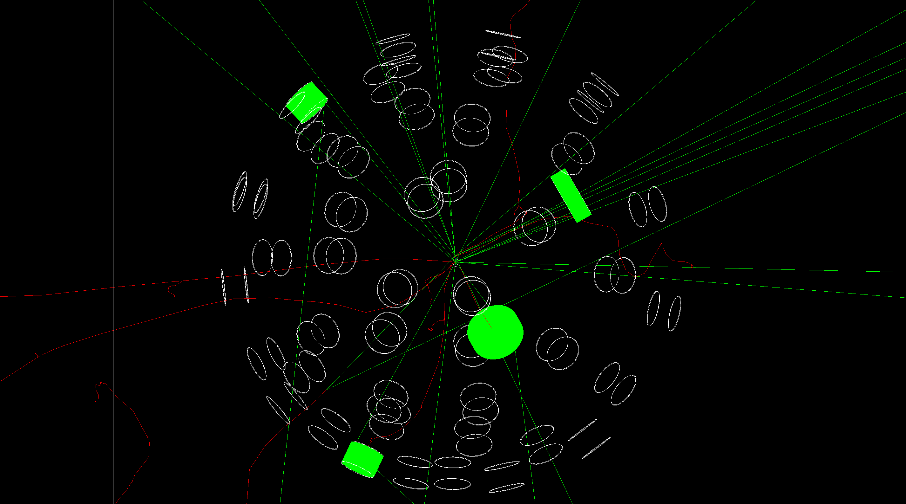
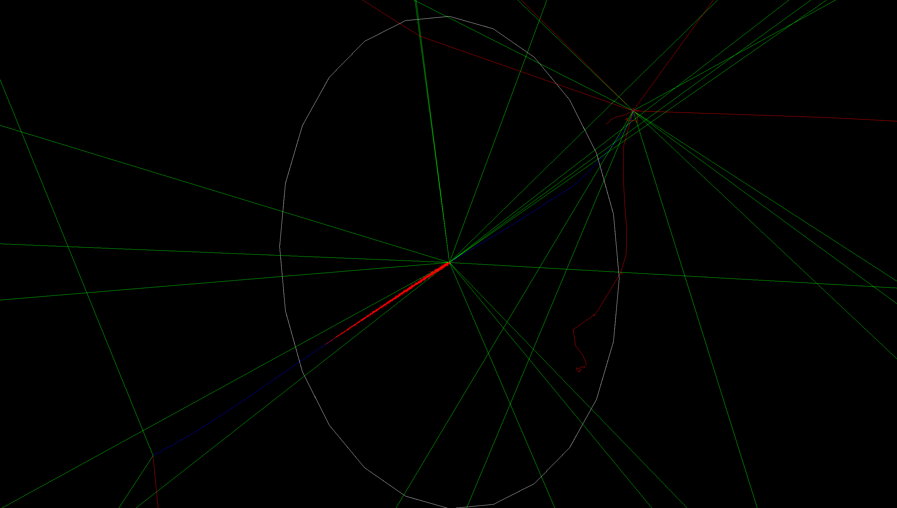

# GEANT4 Simulation of Thermal Neutron-Induced U-235 Fission with Organic and Inorganic Scintillator Readout



Geant4 v11.4.0 simulation of thermal neutron-on-²³⁵U fission with a scintillator detector array — 48 × EJ-309 organic cylinders (forward hemisphere, r = 500 mm, 6 polar rings × 8 azimuths on θ ∈ [20°, 130°] with Tyvek/PTFE diffuse reflective wrap and 1 mm Al housings; Fibonacci-spiral layout retained as a commented swap-in) and 2 × LaBr₃(Ce) crystals (backward angles, r = 300 mm, also Tyvek-wrapped).

## Build & run

Geant4 v11.4.0 must be on the environment for both `cmake`/`make` and the executable. Re-source it for any new terminal:

```
source /path/to/geant4-v11.4.0-install/bin/geant4.sh
```

Out-of-tree build:

```
cd build
cmake ..
make -j
./nuclear_fission           # interactive — opens the OGL viewer
./nuclear_fission run.mac   # headless — writes data/<UTC>/{hits,events}.csv
```

Re-run `cmake ..` (not just `make`) after adding source files or editing a `.mac`.

## Output

Each `/run/beamOn` writes a timestamped subdirectory under `data/` at the repo root:

- `hits.csv` — one row per non-optical-photon track entry into a sensitive scintillator volume (with nonzero edep). Columns: `event_id, detector_id, track_id, particle, creator_process, entry_time_ns, energy_dep_MeV`.
- `events.csv` — one row per event. Columns: `event_id, fission_time_ns, n_prompt_neutrons, n_prompt_gammas, fragment_A_PDG, fragment_B_PDG`. Fission-metadata columns are filled by `MySteppingAction` for every event in which the foil fissions (sub-1% of events at thermal × 0.5 µm); non-fission events leave those columns as empty cells.

## What you'll see in the OGL viewer



Green = neutral (prompt fission neutrons + gammas, escaping to the world boundary). Blue stubs at the foil = fission fragments stopping in microns (correct — they are heavy highly-charged ions). Red = electrons / betas from fragment decay chains. Per-event asymmetry is just momentum conservation of one fission, not a bug.

## Documentation

- [`doc/design.md`](doc/design.md) — detector + DAQ design spec and per-component implementation status.
- [`doc/architecture.md`](doc/architecture.md) — Geant4 code structure, init pipeline, per-event pipeline, CSV output / run lifecycle.
- [`doc/theory.md`](doc/theory.md) — physics of every process the sim touches.
- [`doc/plan.md`](doc/plan.md) — phased implementation plan (Phases A + B + C all landed).
